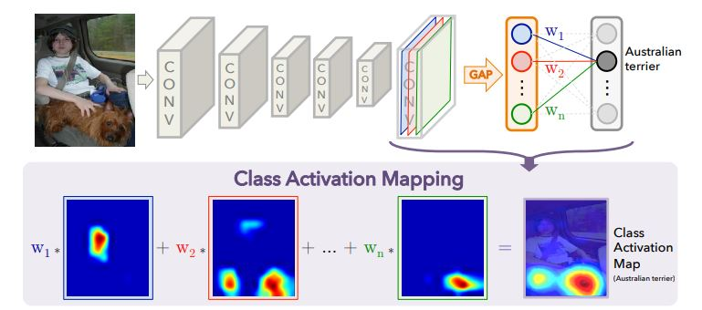
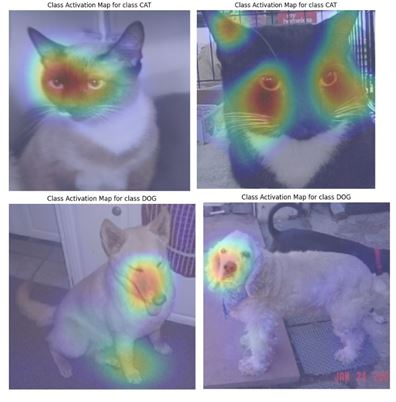
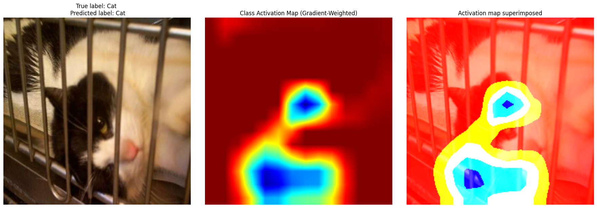
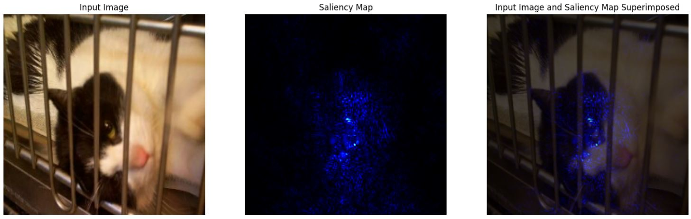
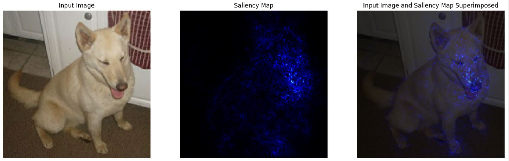

# Interpretability_Methods_on_CNNs

In this project, I implemented and explained three interpretability methods on Convolutional Neural Networks: **Class Activation Map (CAM)**, **Gradient-Weighted CAM (Grad-CAM)**, and **Saliency Map**. 
These methods help identify the regions (features) of an input image that have the most impact on a CNN's predictions. 

The famous **VGG16 network** and **cats_vs_dogs dataset** are used in this project. Since the network was originally trained on the ImageNet dataset, I applied transfer learning and modified the network's top layers to adapt it to the cats_vs_dogs dataset.

1. **CAM** **([paper_link](https://arxiv.org/abs/1512.04150))**: This method, like other interpretability methods mentioned in this project, assigns a weight to each activation map of the last convolutional layer's output. The weights are the last Global Average Pooling layer's coefficients.

We define $M_c(x, y)$ as the activation map for class c: 

$$M_c(x,y) = \Sigma_k w_k^c f_k(x,y)$$

Where $f_k(x,y)$ is the kth filter of the convolutional layer output (located at $(x, y)$ ), and $w_k^c$ is the weight assigned to this filter. 

The final score class, based on which important filters are detected, is:

$$S_c = \Sigma_{x, y} M_c(x, y)$$

As the image indicates, the parts (features) related to animals' noses, eyes, and paws are the most decisive features in classification. 

2. **Grad-CAM** **([paper link](https://arxiv.org/pdf/1610.02391))**: The weights in this method are calculated based on the network's prediction gradient ($y^c$) with respect to $A_{ij}$ activation map:

 $$\alpha^c = \frac{1}{Z} \Sigma_i \Sigma_j \frac{\partial y^c}{\partial A_{ij}}$$

 Where $\alpha^c$ is the weights vector for the activation map $A_{ij}$, which has $i * j$ filters (features). $Z$ is a normalization factor ($Z = i * j$).  
 When the weights are calculated, they are dotted with their corresponding features:

 $$L^c_{Grad-CAM} = ReLU(\alpha^c \; A^k)$$

$L^c_{Grad-CAM}$ above is a heatmap showing important regions of the image in classification. We use $ReLU$ because negative values are not defined for pixels.

2. **Saliency Map ([paper link](https://arxiv.org/abs/1312.6034))**: This method takes derivation with respect to the input image ($I_0$), not convolutional layer outputs.

 $$M_{ij} = |w_{h(ij)}|$$ 
 
 $$w = \frac{\partial S_c(I)}{\partial I}\rvert_{I_0}$$

Where the output saliency map is $M_{ij}$, pixel index is $h(ij)$, $I$ is the vectorized format of input image $I_0$, and $S_c(I)$ is the score or loss function. Notice that the derivation is taken with respect to $I_0$. 

Here is an output saliency map example of a VGG16 classifier network fine-tuned on the cats_vs_dogs dataset:

